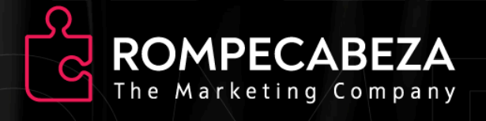

# Prueba Técnica `Parte 1`



## Desarrollo FrontEnd + Adaptacipon Wordpress

## 1.-Objetivo
Evaluar la capacidad de construir una landing sólida a nivel frontend y estructurar dentro de un
theme funcional de WordPress, sin necesidad de conocimientos avanzados de PHP, pero sí con
lógica estructural y orden de desarrollo profesional.

## 2.-Requesitos del entregable

**El repositorio debe incluir:**
    -`/landing `- Maquetación pura (HTML, CSS, JS o Framwork si lo desea)
    -`/wp-theme `- Carpeta de theme WordPress personalizada con la landing implementada
    -`README.md `- Instrucciones para probarlo en local ()

## Parte 1: Construcción de la Landing Page

**Diseño Base**

```js
    - Hero con imagen, texto y CTA
    - Sección de Servicios (mín. 3 cards con icono + título + descripción)
    - Sección de Carrusel Testimonios ( nombre + comentario + foto )
    - Sección de “FAQ” con opciones desplegables
    - Footer con redes sociales y contacto
```

**Tecnologías:**
```js
    - HTML5 + SCSS (o CSS Modules si usa framework)
    - Mobile first / responsive
    - JS Vanilla o React
```

## Parte 2: Adaptación a WordPress Theme

**Objetivo:**
Transformar el código de la landing en la base de un theme funcional en WordPress.
**Archivos mínimos esperados:**
```css
    - style.css (con header estándar de WP)
    - index.php
    - header.php y footer.php
    - functions.php con enqueue de los assets de la landing
    - page-landing.php o front-page.php con HTML de la landing integrado
    - Uso de get_template_directory_uri() para cargar imágenes o estilos
```


