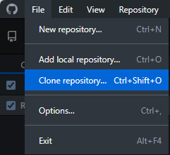
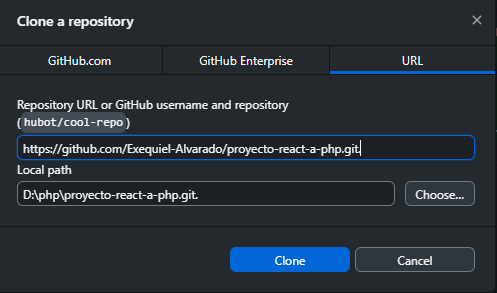
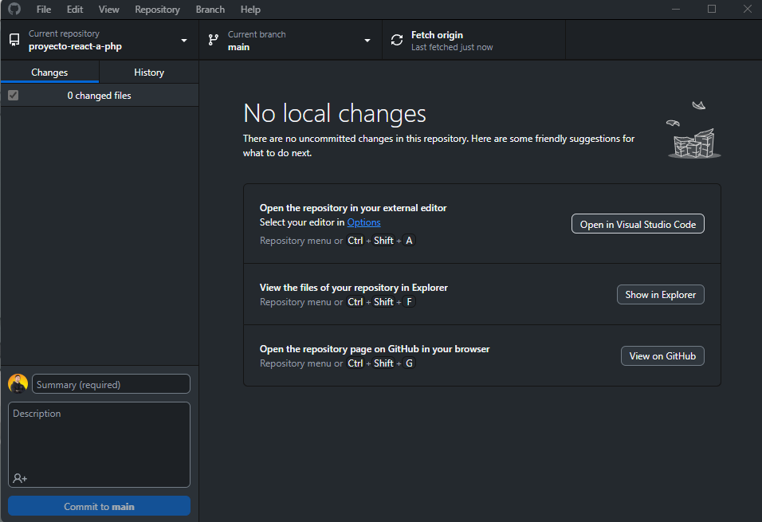

# Prueba Técnica `Parte 1`


## Desarrollo FrontEnd + Adaptacipon Wordpress

## 1.-Objetivo
Evaluar la capacidad de construir una landing sólida a nivel frontend y estructurar dentro de un
theme funcional de WordPress, sin necesidad de conocimientos avanzados de PHP, pero sí con
lógica estructural y orden de desarrollo profesional.

## 2.-Requesitos del entregable

**El repositorio debe incluir:**

- `/landing `- Maquetación pura (HTML, CSS, JS o Framwork si lo desea)
- `/wp-theme `- Carpeta de theme WordPress personalizada con la landing implementada
- `README.md `- Instrucciones para probarlo en local ()

## Parte 1: Construcción de la Landing Page

**Diseño Base**

```js
- Hero con imagen, texto y CTA
- Sección de Servicios (mín. 3 cards con icono + título + descripción)
- Sección de Carrusel Testimonios ( nombre + comentario + foto )
- Sección de “FAQ” con opciones desplegables
- Footer con redes sociales y contacto
```

**Tecnologías:**
```js
- HTML5 + SCSS (o CSS Modules si usa framework)
- Mobile first / responsive
- JS Vanilla o React
```

## Parte 2: Adaptación a WordPress Theme

**Objetivo:**
Transformar el código de la landing en la base de un theme funcional en WordPress.
**Archivos mínimos esperados:**
```css
- style.css (con header estándar de WP)
- index.php
- header.php y footer.php
- functions.php con enqueue de los assets de la landing
- page-landing.php o front-page.php con HTML de la landing integrado
- Uso de get_template_directory_uri() para cargar imágenes o estilos
```

## Paso a seguir para `Parte 1` ---> para que funciones de manera local  n.n!
**Deben tener instalado lo siguiente**


- `Node.js `- Instarlarlo de manera global .
- `npm `- para ejecutar comando dentro del terminal.
- `Visual Estudio Code `- Herramienta para ejecutar el proyecto.
- `Git `- Para ocupar la terminal.
- `Githud Desktop `- para poder Clonar la rama. 

**Paso a seguir para Clonar Repositorio**
`Git`
1. Abrir el termina de `Git Bash`
2. Colocar el siguiente comando para selecionar la carpeta donde se va a guardar
```bash
cd ruta/a/mi/carpeta
```
3. Luego Clonar el repositorio usando el siguiente comando `git clone`
```bash
git clone https://github.com/Exequiel-Alvarado/proyecto-react-a-php.git
```
4. Luego ingresa a la carpeta del proyecto y clip secundario abrir con `VS Code`

Ahora Otra Opcion para clonar el repositorio

`GitHub Desktop`
1. Abre `GitHub Desktop`
2. Haz click en `File > Clone repository…` o usa el botón + en la esquina superior izquierda y elige `"Clone repository"`.



3. Puedes buscar el repositorio si está en tu cuenta o pegar la `URL del repositorio`.
- esta es la URL: https://github.com/Exequiel-Alvarado/proyecto-react-a-php.git



4. Elige la carpeta de destino donde se guardará el repositorio en tu computador.
Haz `click en Clone`.
5. Luego acceder a `Visual Etudio Code`



**Paso a seguir para en VS Code**
1. en terminal selecionamos `bash`
2. ejecutamos el siguiente comando
```bash
npm install
```
3. para correrlo en la misma terminal ejecutamos el siguiente comando
```bash
npm run dev
```
4. hacemos clip en donde dice `local host:"puerto"` se abrira el Leandin Page.


